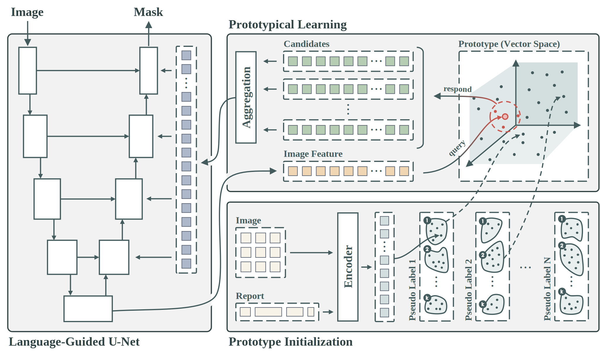
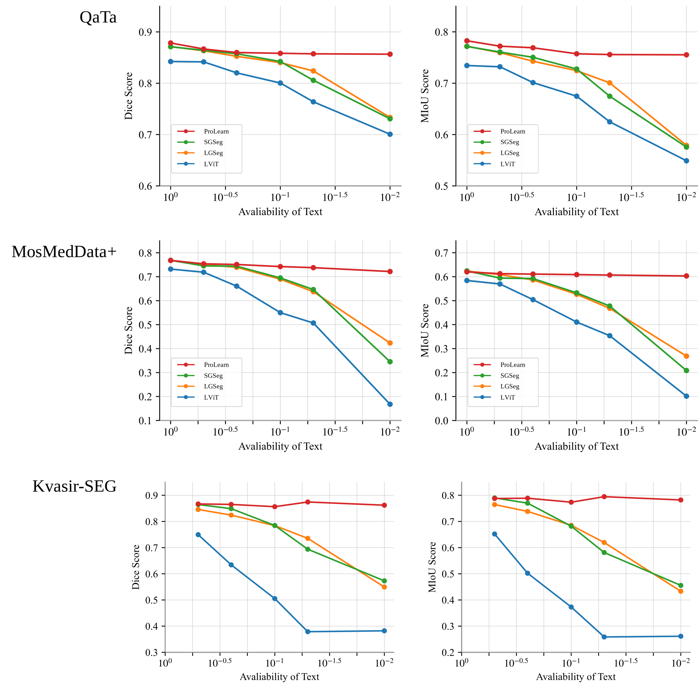

<div align="center">
<h1>ProLearn: Alleviating Textual Reliance in Medical Language-guided Segmentation via Prototype-driven Semantic Approximation</h1>

<a href="https://arxiv.org/pdf/2507.11055" target="_blank" rel="noopener noreferrer">
  
</a>
<a href="https://arxiv.org/abs/2507.11055"></a>
<a href="https://shuchangye-bib.github.io/websites/ProLearn/prolearn.html"></a>

**[The University of Sydney](https://www.sydney.edu.au)**; **[Macquarie University](https://www.mq.edu.au)**

[Shuchang Ye](https://shuchangye-bib.github.io), [Usman Naseem](https://researchers.mq.edu.au/en/persons/usman-naseem), [Mingyuan Meng](https://mungomeng.github.io), [Jinman Kim](https://www.sydney.edu.au/engineering/about/our-people/academic-staff/jinman-kim.html)
</div>

## 🚀 Overview

**ProLearn** introduces a significant advancement beyond our previous work, [SGSeg](https://github.com/ShuchangYe-bib/SGSeg), by deeper analyzing and addressing one of the core limitations of medical language-guided segmentation: *textual reliance*.

🔍 Why is textual reliance a problem?

📝 Most medical segmentation datasets lack paired reports, leaving large amounts of image-only data unused for training.

📝 Inference often requires text input, which is impractical in real clinical workflows, where segmentation usually precedes reporting.

🧠 **ProLearn**: the first prototype-driven learning framework that enables 1) image-only, image-text data mix training; 2) inference with limited or no textual input.



---

## 📉 Performance Under Limited Text

To simulate real-world incomplete pairing, we train ProLearn with only **1% to 50%** paired text data and compare it with SOTA language-guided models. Unlike others, **ProLearn maintains performance even under extreme text scarcity**.



---

## 🔬 Qualitative & Interpretability Analysis

ProLearn produces robust and localized segmentation maps, even without text. Its **PSA module** preserves attention saliency and lesion coherence — outperforming baselines like SGSeg and LViT.


---

## Prototype zoo
We provide prototypes for you to play with:


| Dataset    | Surrogate_labels | Prototypes/label | Dimension  | Size   | Weights   |
|:----------:|:----------------:|:----------------:|:----------:|:------:|:----------|
| QaTa-COV19 |        6         |        2         |    1024    |  9.5MB | [prototype_qata_6_2_1024](https://github.com/ShuchangYe-bib/ProLearn/blob/main/prototypes/prototype_qata_6_2_1024_contrastive.pkl) |
| QaTa-COV19 |        6         |        4         |    1024    |   19MB | [prototype_qata_6_4_1024](https://github.com/ShuchangYe-bib/ProLearn/blob/main/prototypes/prototype_qata_6_4_1024_contrastive.pkl) |
| QaTa-COV19 |        6         |        8         |    1024    | 37.9MB | [prototype_qata_6_8_1024](https://github.com/ShuchangYe-bib/ProLearn/blob/main/prototypes/prototype_qata_6_8_1024_contrastive.pkl) |
| QaTa-COV19 |        6         |       16         |    1024    | 75.9MB | [prototype_qata_6_16_1024](https://github.com/ShuchangYe-bib/ProLearn/blob/main/prototypes/prototype_qata_6_16_1024_contrastive.pkl) |

All files available at: [./prototypes](https://github.com/ShuchangYe-bib/ProLearn/tree/main/prototypes)

---

## Quick Start

First, clone this repository to your local machine and install the dependencies. 

```bash
git clone git@github.com:ShuchangYe-bib/ProLearn.git
cd ProLearn
conda create --name prolearn python=3.11
conda activate prolearn
pip install -r requirements.txt
```

Now, train and test the model with just few lines of code:

```bash
python3 train.py
python3 test.py
```

---

## Training

1. To finetune our pretrain model, specify the path of the pretrained model in ```checkpoint_path``` parameter in ```config/training.yaml```
OR
To train our model from scratch, set the ```checkpoint_path``` parameter in ```config/training.yaml``` to ```None```

2. Customize the following parameters in ```config/training.yaml``` for customized training process:
- ```train_batch_size``` -  the number of samples to be processed in an epoch
- ```image_size``` - tuple of ```(H, W)```
- ```min_epochs``` - minimum epochs of training (unaffected by validation metric)
- ```max_epochs``` - maximum epochs of training
- ```patience``` - the number of epochs to wait before discontinuing the training process if the validation metric has not improved

3. Run ```python3 train.py```

## Test
To evaluate the performance of our model:
1. Specify the path of the pretrained model in ```checkpoint_path``` parameter in ```config/training.yaml```

2. Run evaluation ```python3 test.py```

---

## License
This project is licensed under the MIT License - see the [LICENSE](LICENSE) file for details.

## 📚 Citation

If you find ProLearn useful in your research, please consider citing:

```bibtex
@misc{ye2025prolearn,
  title={Alleviating Textual Reliance in Medical Language-guided Segmentation via Prototype-driven Semantic Approximation},
  author={Shuchang Ye and Usman Naseem and Mingyuan Meng and Jinman Kim},
  year={2025},
  eprint={2507.11055},
  archivePrefix={arXiv},
  primaryClass={cs.CV},
  url={https://arxiv.org/abs/2507.11055}
}
```
